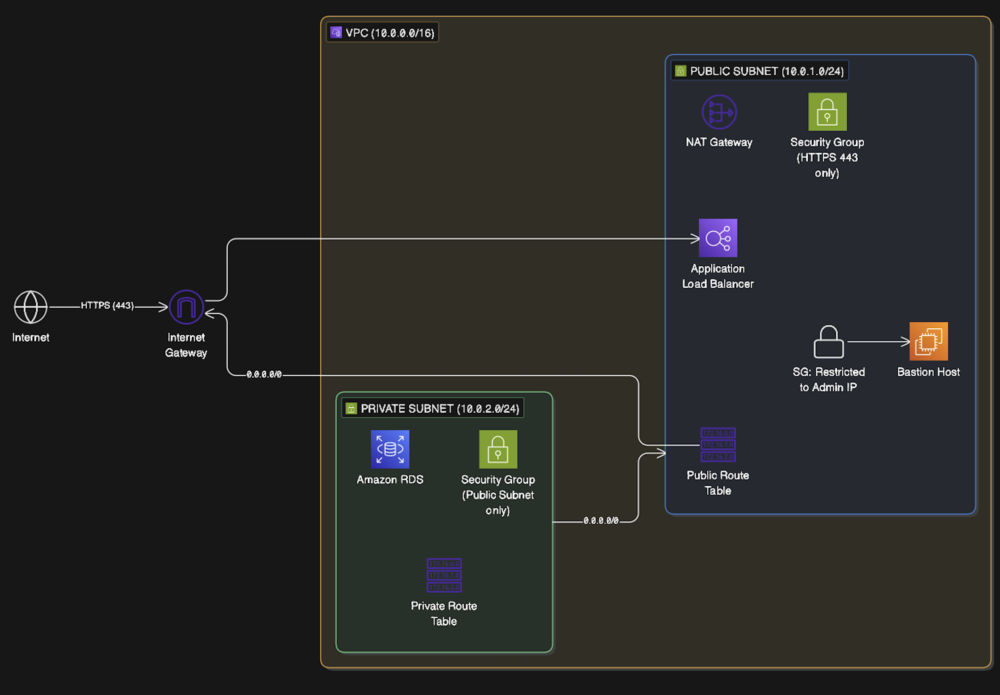

# P1 - Highly Available Multi-Tier Network Architecture (IaC)
### Built with Terraform (Infrastructure as Code) | AWS | Cloud Security

---

## Overview

This project builds a secure network environment on AWS using Terraform — 
a tool that lets you provision and spin up infrastructure as code, rather than clicking 
through the AWS Console manually.

The goal is to show how you can separate public-facing resources from 
sensitive backend systems, so that critical data is never directly exposed 
to the internet. This mirrors the kind of architecture you would need in 
environments where data security is non-negotiable, such as the public sector 
or law enforcement systems.

---

## What Problem Does This Solve?

Imagine a bank. Customers interact with the front desk — but the vault is 
locked away in a back room that only authorised staff can access. You would 
never leave the vault accesible to anyone. 

This project applies that same logic to cloud infrastructure:

- The **Public Subnet** is the front desk > it faces the internet
- The **Private Subnet** is the vault > it is completely hidden from the internet
- **Security Groups** are the security guards > they decide who is allowed in and out

---

## Architecture Diagram


```
## What Gets Built

Since you have now added the **NAT Gateway**, **Bastion Host**, and **Elastic IP**, your README needs to reflect this advanced "Enterprise-Grade" setup.

This update focuses on the "Why" and the "How," making it perfect for an interviewer to read and immediately see your value as an **Infrastructure Analyst**.

---

## 🛠️ Updated README.md Sections

Replace the corresponding sections in your existing README with this updated content:

### 🏗️ What Gets Built

This project provisions a **Three-Tier Network Architecture** designed for high security and administrative control.

| Resource | What It Does |
| --- | --- |
| **VPC** | A private, isolated network perimeter in the **London (eu-west-2)** region. |
| **Public Subnet** | The "Front Desk" for internet-facing resources like the Bastion Host. |
| **Private Subnet** | The "Vault" for sensitive data; completely unreachable from the outside world. |
| **Internet Gateway** | The controlled entry point for all inbound traffic to the public tier. |
| **NAT Gateway** | Allows private resources to fetch updates (Outbound) without being exposed to the Internet (Inbound). |
| **Bastion Host** | A secure "Jump Box" in the public subnet used for administrative access to the network. |
| **Security Groups** | Statefull firewalls enforcing the **Principle of Least Privilege** (e.g., HTTPS only). |

---

### 💡 How It All Works: The Security Logic

The architecture follows a **"Defence in Depth"** strategy, which is critical for organisations handling sensitive law enforcement data:

1. **Isolation**: By placing resources in the Private Subnet, we ensure they have no direct path to the internet.
2. **Unidirectional Traffic**: The **NAT Gateway** ensures that if a server in the private subnet needs a security patch, it can request it, but a hacker cannot use that same path to get back in.
3. **Encrypted Ingress**: All public traffic is restricted to **HTTPS (Port 443)**, ensuring data in transit is always encrypted.
4. **Administrative Control**: The **Bastion Host** acts as a single, auditable gatekeeper for any backend maintenance.

---

### 🛡️ What Problem Does This Solve?

In high-stakes industries like the public sector, a single misconfiguration can lead to a massive data breach. This project solves three core problems:

* **Data Sovereignty**: Hard-coded UK region deployment ensures legal compliance with UK data laws.
* **Human Error**: By using **Infrastructure as Code (IaC)**, we eliminate "Manual Clicking" in the AWS Console, ensuring the environment is built exactly the same way every time.
* **Attack Surface Reduction**: By hiding the "Vault" (Private Subnet) and using a "Security Guard" (Security Group), we reduce the number of ways a malicious actor can enter the network.

---

### 🚀 How to Use This Project

**Prerequisites**

* [Terraform](https://developer.hashicorp.com/terraform/install) installed.
* [AWS CLI](https://aws.amazon.com/cli/) configured with an IAM user (`aws configure`).
* Git is installed on your local machine.

**Deployment Steps**

```bash
# 1. Clone the repository
git clone https://github.com/Jpx-110/P1-Highly-Available-Multi-Tier-Network-Architecture-IaC-.git
cd P1-Highly-Available-Multi-Tier-Network-Architecture-IaC

# 2. Initialise the environment
terraform init

# 3. Analyse the infrastructure plan
terraform plan

# 4. Provision the architecture to AWS London
terraform apply

# 5. Clean up resources to avoid costs
terraform destroy

```

---

### 🎓 The Final Mentor Advice

Now that you've updated this, make sure to **Commit and Push** these changes to GitHub!

```bash
git add README.md
git commit -m "docs: updated README with NAT Gateway and architecture logic"
git push origin main

```

**Would you like me to help you draft a "Project 1 Summary" for your CV?** We can condense all this technical work into 3 bullet points that hit the **CVF competencies** (Ownership, Analysis, and Informed Decision Making).

